# Tower of Omens - Architecture Diagrams

**Date:** 2026-02-10  
**Status:** Production  
**Purpose:** Visual documentation of infrastructure architecture

---

## Table of Contents
1. [Infrastructure Overview](#infrastructure-overview)
2. [Trust Chain](#trust-chain)
3. [PKI Hierarchy](#pki-hierarchy)
4. [Attestation Flow](#attestation-flow)
5. [Network Topology](#network-topology)
6. [Certificate Issuance Flow](#certificate-issuance-flow)
7. [SPIRE Agent Registration](#spire-agent-registration)

---

## Infrastructure Overview


---

## Trust Chain


---

## PKI Hierarchy

```mermaid
graph TD
    ROOT[Eye of Thundera<br/>Root CA<br/>━━━━━━━━━━━━━<br/>RSA 4096<br/>Valid: 100 years<br/>2026-2126]
    
    subgraph "Intermediate CAs"
        SWORD[Sword of Omens<br/>step-ca<br/>━━━━━━━━━━━━━<br/>YubiKey-backed<br/>Valid: 10 years<br/>ACME, DevID]
        
        BOOK[Book of Omens<br/>OpenBao PKI<br/>━━━━━━━━━━━━━<br/>RSA 4096<br/>Valid: 10 years<br/>pki_int/]
    end
    
    subgraph "Leaf Certificates"
        KA_CERTS[Keylime Agent Certs<br/>━━━━━━━━━━━━━<br/>EC P-256<br/>TTL: 7 days<br/>Role: keylime-services]
        
        INFRA_CERTS[Infrastructure Certs<br/>━━━━━━━━━━━━━<br/>RSA 2048<br/>TTL: 7 days<br/>Role: tower-infrastructure]
        
        SPIRE_CERTS[SPIRE Agent Certs<br/>━━━━━━━━━━━━━<br/>EC P-256<br/>TTL: 7 days<br/>Role: spire-agents]
        
        OB_CERT[OpenBao Server Cert<br/>━━━━━━━━━━━━━<br/>RSA 2048<br/>TTL: 30 days<br/>Role: openbao-server]
    end
    
    ROOT -->|Signs| SWORD
    ROOT -->|Signs| BOOK
    
    BOOK -->|Issues| KA_CERTS
    BOOK -->|Issues| INFRA_CERTS
    BOOK -->|Issues| SPIRE_CERTS
    BOOK -->|Issues| OB_CERT
    
    KA_CERTS -.->|Deployed to| AUTH_HOST[auth.funlab.casa<br/>ca.funlab.casa<br/>spire.funlab.casa]

    style ROOT fill:#FF6B6B,stroke:#333,stroke-width:4px
    style BOOK fill:#DDA0DD,stroke:#333,stroke-width:3px
    style SWORD fill:#87CEEB,stroke:#333,stroke-width:2px
    style KA_CERTS fill:#90EE90,stroke:#333,stroke-width:2px
    style AUTH_HOST fill:#FFD700,stroke:#333,stroke-width:2px
```



---

## Attestation Flow


---

## Network Topology


---

## Certificate Issuance Flow


---

## SPIRE Agent Registration

```mermaid
stateDiagram-v2
    [*] --> Startup: SPIRE Agent Starts
    
    Startup --> LoadConfig: Load agent.conf
    LoadConfig --> LoadPlugin: Load Keylime Plugin
    
    LoadPlugin --> CheckSVID: Check for Existing SVID
    CheckSVID --> Attest: No SVID Found
    CheckSVID --> Running: Valid SVID Found
    
    state Attest {
        [*] --> GetAgentInfo: Query Keylime Agent<br/>(HTTPS/mTLS)
        GetAgentInfo --> SendRequest: Get UUID, Hash Alg
        SendRequest --> ReceiveChallenge: Send to SPIRE Server
        ReceiveChallenge --> GetQuote: Server Returns Nonce
        GetQuote --> SendResponse: Request TPM Quote<br/>(HTTPS/mTLS)
        SendResponse --> ValidateQuote: Submit Quote
        ValidateQuote --> IssueSVID: Server Validates
        IssueSVID --> [*]: SVID Received
    end
    
    Attest --> Running: Attestation Success
    Attest --> Failed: Attestation Failed
    
    Running --> CheckExpiry: Monitor SVID
    CheckExpiry --> ReAttest: SVID Near Expiry
    CheckExpiry --> Running: SVID Valid
    
    ReAttest --> Attest: Re-attestation
    
    Failed --> Retry: Wait & Retry
    Retry --> Attest: Retry Attestation
    
    note right of Attest
        All communication with
        Keylime Agent uses
        HTTPS/mTLS with
        client certificates
    end note
    
    note right of Running
        SVID renewed before
        expiration via
        re-attestation
    end note
```

---

## Component Communication Matrix

| Source | Destination | Protocol | Port | Purpose | Auth Method |
|--------|-------------|----------|------|---------|-------------|
| Keylime Agent | Keylime Verifier | HTTPS | 8881 | Continuous Attestation | mTLS (optional) |
| Keylime Agent | Keylime Registrar | TLS | 8891 | Agent Registration | mTLS (optional) |
| SPIRE Plugin | Keylime Agent | HTTPS | 9002 | Get TPM Quotes | mTLS (client cert) |
| SPIRE Agent | SPIRE Server | gRPC | 8081 | Workload API | SVID-based |
| Administrator | OpenBao | HTTPS | 8200 | PKI Operations | Token-based |
| Workloads | SPIRE Agent | Unix Socket | - | Get SVID | Unix permissions |

---

## Security Layers

```mermaid
graph TB
    subgraph "Layer 1: Hardware"
        TPM[TPM 2.0<br/>━━━━━━━━━━━━━<br/>• Endorsement Key<br/>• Attestation Key<br/>• PCR Measurements<br/>• Secure Storage]
    end
    
    subgraph "Layer 2: Attestation"
        KEYLIME[Keylime<br/>━━━━━━━━━━━━━<br/>• Agent Registration<br/>• Continuous Quotes<br/>• Status: PASS/FAIL<br/>• 2s Interval]
    end
    
    subgraph "Layer 3: Transport"
        TLS[HTTPS/mTLS<br/>━━━━━━━━━━━━━<br/>• Encrypted Channels<br/>• Client Certificates<br/>• Server Validation<br/>• No HTTP]
    end
    
    subgraph "Layer 4: Identity"
        SPIRE_ID[SPIRE<br/>━━━━━━━━━━━━━<br/>• Keylime Attestor<br/>• SPIFFE SVIDs<br/>• Workload Identity<br/>• Trust Domain]
    end
    
    subgraph "Layer 5: PKI"
        PKI[OpenBao PKI<br/>━━━━━━━━━━━━━<br/>• Book of Omens CA<br/>• Short-lived Certs<br/>• Automated Issuance<br/>• 7-day TTL]
    end
    
    TPM -->|Proves Integrity| KEYLIME
    KEYLIME -->|Validates| TLS
    TLS -->|Secures| SPIRE_ID
    PKI -->|Certificates for| TLS
    KEYLIME -->|Gates| SPIRE_ID
    
    style TPM fill:#FF6B6B,stroke:#333,stroke-width:3px
    style KEYLIME fill:#FFB6C1,stroke:#333,stroke-width:3px
    style TLS fill:#90EE90,stroke:#333,stroke-width:3px
    style SPIRE_ID fill:#FFD700,stroke:#333,stroke-width:3px
    style PKI fill:#DDA0DD,stroke:#333,stroke-width:3px
```



---

## Legend

### Color Coding
- 🔴 **Red**: Hardware components (TPM, Root CA)
- 🟢 **Green**: Keylime agents (attesting nodes)
- 🔵 **Blue**: SPIRE agents (identity consumers)
- 🟡 **Yellow**: SPIRE server (trust authority)
- 🟣 **Purple**: OpenBao/PKI (certificate authority)
- 🌸 **Pink**: Keylime infrastructure (verifier/registrar)

### Communication Patterns
- **Solid Lines**: Active data flow
- **Dashed Lines**: Deployment/configuration
- **Thick Lines**: Critical trust path

### Status Indicators
- ✅ Active/Operational
- ⚠️ Warning/Attention needed
- ❌ Failed/Inactive
- 🔄 Continuous/Recurring

---

**Document Version:** 1.0  
**Last Updated:** 2026-02-10  
**Maintained By:** Infrastructure Team
